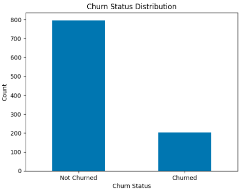
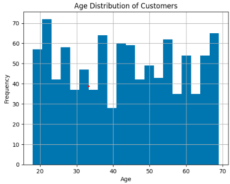
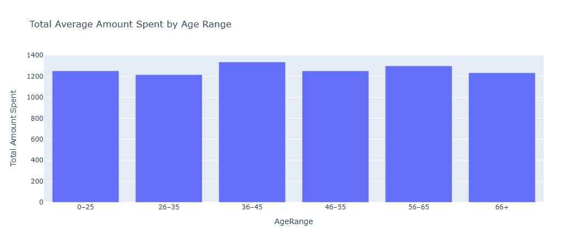
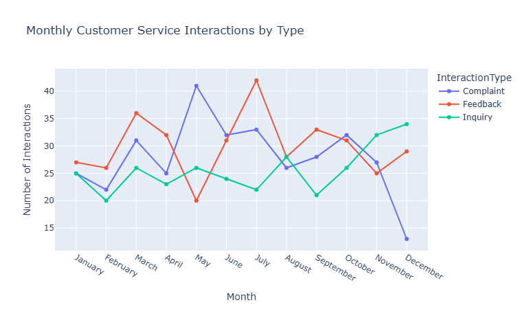
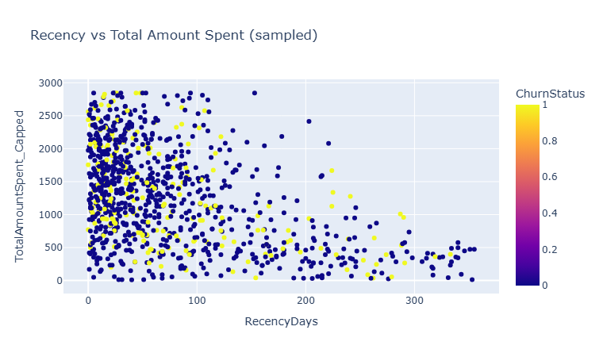
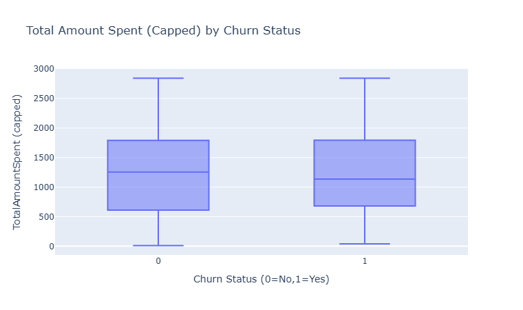
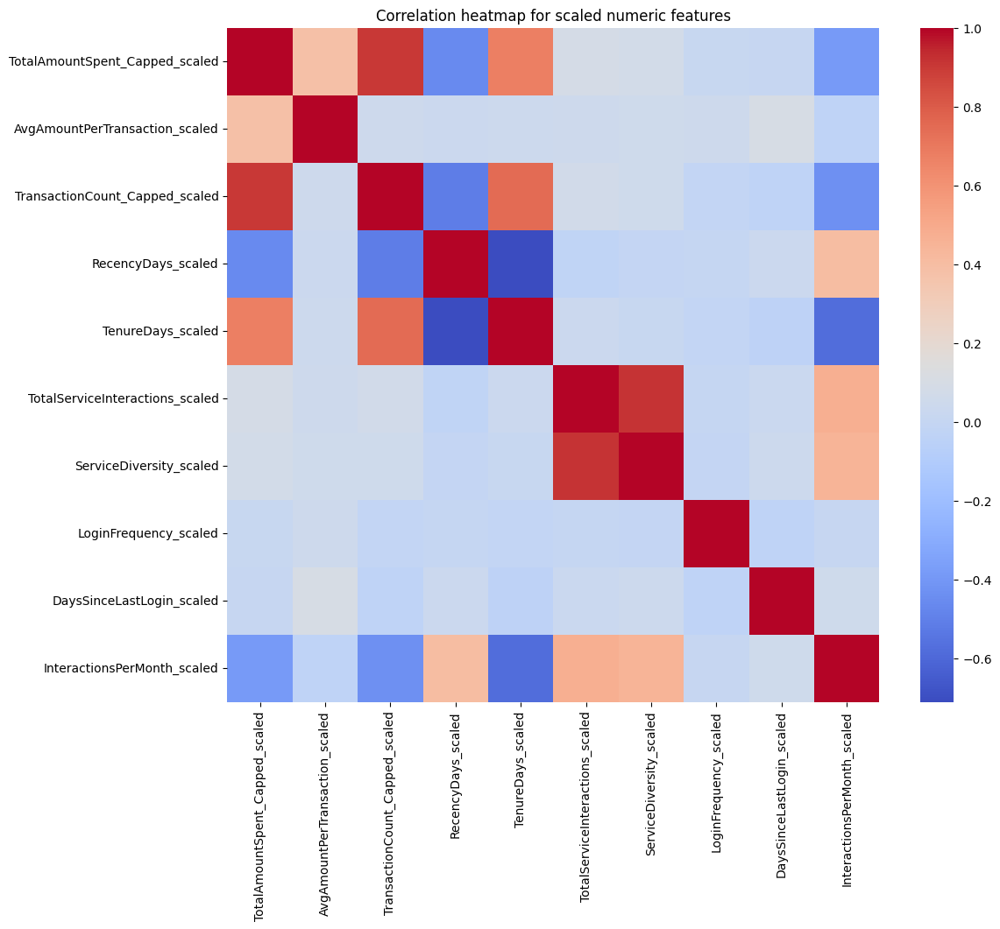
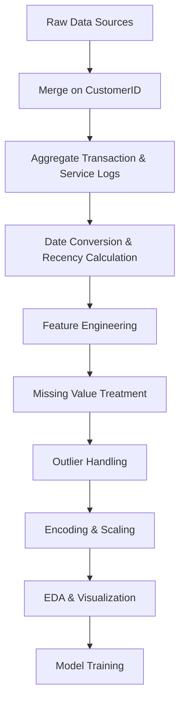

# Customer Churn Analysis – Data Preparation & EDA

## 📌 Introduction

This project performs the initial steps required to create a predictive **customer churn machine learning model**.The goals of this initial phase are to:

- Combine multiple data sources relevant to customer behavior.
- Perform **exploratory data analysis (EDA)** to uncover patterns associated with churn.
- Clean and preprocess the dataset for modeling.
- Engineer new features to improve model accuracy.

---

## 📂 Data Sources & Rationale

The analysis uses multiple datasets, each providing different behavioral and demographic insights:

| Dataset Name                    | Description                                                                                                      |
| ------------------------------- | ---------------------------------------------------------------------------------------------------------------- |
| **Customer_Demographics** | Contains personal attributes for each customer.                                                                  |
| **Transaction_History**   | Dates and amounts of transactions capturing**spending behavior**, **recency**, and **tenure**. |
| **Customer_Service**      | Records of customer support interactions (dates & types), which may signal dissatisfaction or high engagement.   |
| **Online_Activity**       | Login frequency, last login date, and service usage, useful for identifying retention signals.                   |
| **Churn_Status**          | Binary label (0 = active, 1 = churned).                                                                          |

> Together, these datasets provide a **holistic view of customer behavior** across purchasing, support interactions, and online activity.

---

## 🔄 Data Processing Summary

1. **Data Merging**

   - All datasets merged on `CustomerID` using a **left join** onto demographics.
   - Aggregated transactional and service logs (e.g., first/last transaction dates, total spend, transaction counts).
2. **Date Handling**

   - Converted date columns to `datetime`.
   - Used the **max TransactionDate** in the dataset as a reference to compute *RecencyDays*.
3. **Feature Engineering**
   Created key features for churn modeling:

| Feature Name                 | Description                              |
| ---------------------------- | ---------------------------------------- |
| `FirstTransactionDate`     | Start of customer relationship.          |
| `LastTransactionDate`      | Most recent purchase date.               |
| `TotalAmountSpent`         | Lifetime spending.                       |
| `AvgAmountPerTransaction`  | Spending style metric.                   |
| `TransactionCount`         | Purchase frequency.                      |
| `TotalServiceInteractions` | Volume of customer service interactions. |
| `ServiceDiversity`         | Variety of service channels used.        |
| `RecencyDays`              | Days since last purchase.                |
| `TenureDays`               | Relationship length.                     |
| `DaysSinceLastLogin`       | Online engagement measure.               |

4. **Missing Value Treatment**

   - Counts (e.g., service interactions) → filled with `0`.
   - Dates → filled with proxies (e.g., `LastLoginDate` if `LastInteractionDate` missing).
   - Numeric columns → filled with median values.
5. **Outlier Treatment & Scaling**

   - **Winsorized** `TotalAmountSpent` and `TransactionCount` at the 99th percentile.
   - **One-hot encoded** categorical features (e.g., marital status, gender, income level).
   - **StandardScaler** applied to numeric features; scaler saved for consistency.

---

## 📊 EDA Highlights

### Churn Distribution

Balanced churn rate allows for fair investigation into retention and attrition factors.

### Customer Age Profile

Majority between **25–44 years old** — indicates strong appeal in this demographic but opportunity to expand reach.

### Spending by Age

Ages **35–54** spend more on average — ideal targets for loyalty and upsell campaigns.

### Channel Usage Patterns

Some service channels dominate — prioritize these while improving underutilized ones.

### Recency vs. Total Amount Spent

- High spenders tend to have **low RecencyDays**.
- Higher recency + low spending aligns with churn risk.

### Total Spending by Churn Status

- Non-churned customers have higher median spend.
- Lower spending is a potential churn signal.

### Correlation Insights

- Strong positive correlation: **TotalAmountSpent** ↔ **TransactionCount**.
- **RecencyDays** negatively correlates with spending and transactions.

---

## 📁 Files Produced

- **`customer_churn_analysis_cleaned.csv`** — Cleaned, feature-engineered, encoded, and scaled dataset ready for modeling.
- **`numeric_scaler.save`** — `StandardScaler` object for consistent preprocessing.

---

## ✅ Conclusion & Next Steps

The dataset is fully prepared for model training.Next steps:

1. Build classification models.
2. Tune hyperparameters.
3. Run **SHAP explainability** to guide retention strategies.

---

## 📌 Data Pipeline Diagram

