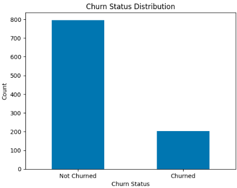
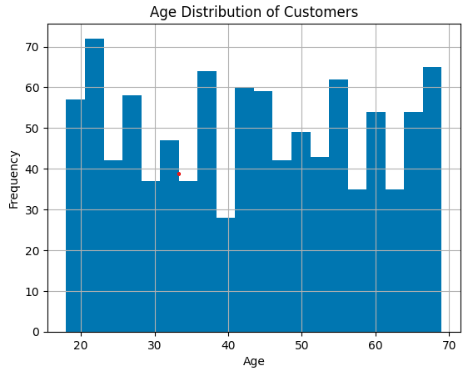
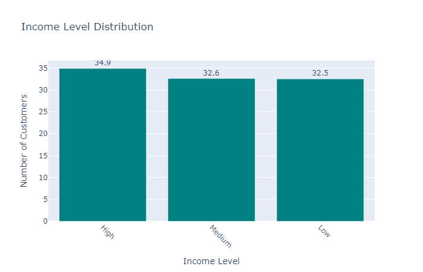
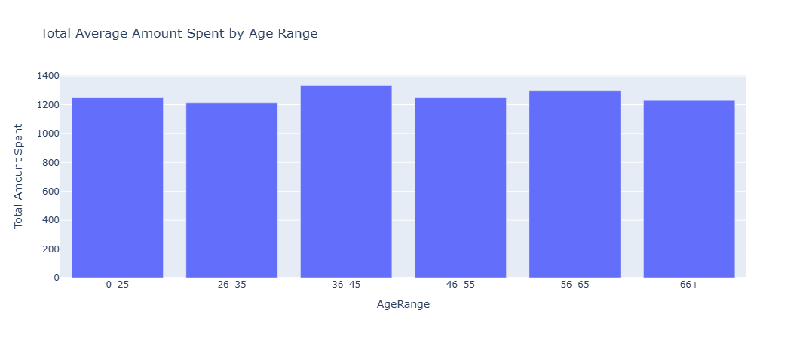
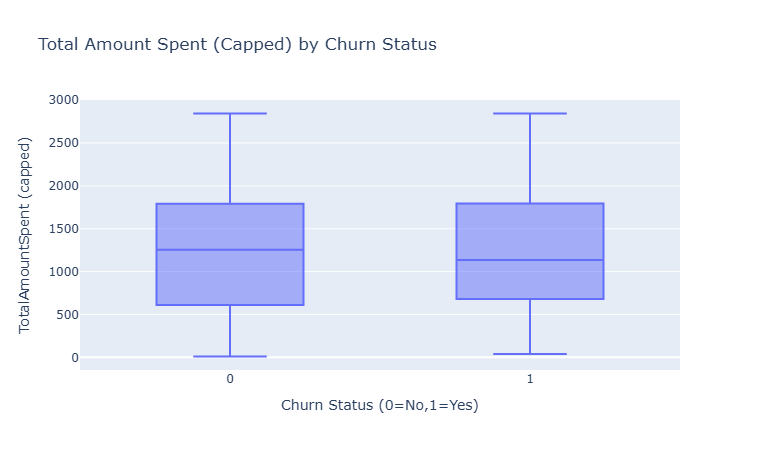
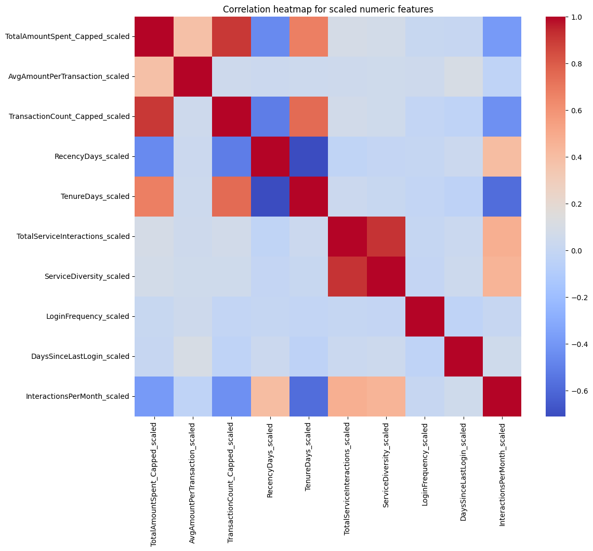
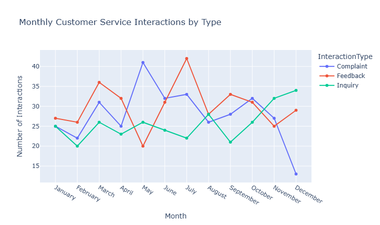
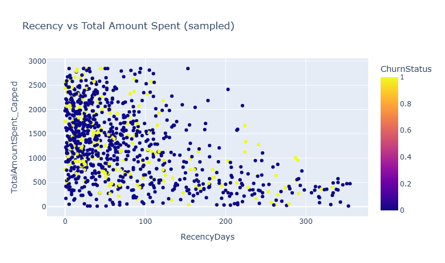

# Customer Churn Analysis — Lloyds Banking Group

Exploratory data analysis and baseline churn-prediction modeling across customer demographics, transactions, service interactions, and online activity.

*Portfolio project completed as part of a virtual data-analytics experience; the dataset is simulated (see Assumptions and Caveats).*

# Project Background

Lloyds Banking Group is one of the UK's largest financial services organizations, serving millions of retail and commercial customers through brands including Lloyds Bank, Halifax, and Bank of Scotland. In retail banking, customer retention is a core business lever — acquiring a new customer costs substantially more than retaining an existing one — so churn rate, average revenue per user (ARPU), and engagement depth are key metrics the business tracks.

Working from the perspective of a data analyst on the customer analytics team, this project investigates the drivers of customer churn: I merged five customer data sources, engineered behavioral features, ran exploratory analysis to surface churn signals, and trained baseline classification models to flag at-risk customers for retention outreach.

Insights and recommendations are provided on the following key areas:

- **Customer Demographics & Segmentation:** age and income profile of the customer base and which segments spend the most.
- **Spending & Transaction Behavior:** revenue per customer, spending distributions, and how spending relates to churn.
- **Engagement & Service Interactions:** support-contact patterns, channel usage, and login/recency engagement signals.
- **Churn Indicators & Model Performance:** the 20.4% churn rate, leading indicators, and baseline model evaluation.

The data cleaning, feature engineering, and EDA code for this analysis can be found in [data_cleaning.ipynb](phaseOne/data_cleaning.ipynb).

The churn-modeling code (resampling, training, and evaluation) can be found in [machine_learning_phase.ipynb](phaseTwo/machine_learning_phase.ipynb).

Written reports summarizing the findings are available here: [Phase 1 analysis report (PDF)](<phaseOne/Lloyds Banking Group Report.pdf>) and [Phase 2 machine learning report (PDF)](<phaseTwo/Lloyds Banking Group Machine Algorithm Report.pdf>).

# Data Structure & Initial Checks

The dataset (`Customer_Churn_Data_Large.xlsx`) consists of five tables joined on `CustomerID`, with a combined row count of **8,056 records** describing 1,000 customers. A description of each table is as follows:

- **Customer_Demographics** (1,000 rows): one row per customer — `Age`, `Gender`, `MaritalStatus`, `IncomeLevel`.
- **Transaction_History** (5,054 rows): individual transactions — `TransactionID`, `TransactionDate`, `AmountSpent`, `ProductCategory`.
- **Customer_Service** (1,002 rows): support interactions — `InteractionID`, `InteractionDate`, `InteractionType`, `ResolutionStatus`.
- **Online_Activity** (1,000 rows): digital engagement — `LastLoginDate`, `LoginFrequency`, `ServiceUsage` (channel).
- **Churn_Status** (1,000 rows): binary target label — `ChurnStatus` (0 = active, 1 = churned).

```
                    Customer_Demographics (1,000 customers)
                                │ CustomerID
        ┌───────────────────────┼───────────────────────┐
        │                       │                       │
Transaction_History      Customer_Service         Online_Activity
(5,054 transactions)     (1,002 interactions)     (1,000 records)
                                │
                        Churn_Status (1,000 labels)
```

**Initial checks:** all five sheets passed completeness checks with no null values and consistent `CustomerID` keys. Cleaning then produced a single modeling table — `customer_churn_analysis_cleaned.csv` (1,000 rows × 32 columns) — through the following steps:

- Aggregated transactions and interactions per customer (first/last dates, counts, totals, averages).
- Engineered features: `TotalAmountSpent`, `AvgAmountPerTransaction`, `TransactionCount`, `TotalServiceInteractions`, `ServiceDiversity`, `RecencyDays`, `TenureDays`, `DaysSinceLastLogin`, `InteractionsPerMonth`.
- Filled missing counts with 0 and missing numerics with the median; proxied missing interaction dates from login/transaction dates.
- Winsorized `TotalAmountSpent` and `TransactionCount` at the 99th percentile.
- One-hot encoded `MaritalStatus`, `Gender`, `IncomeLevel`, `ServiceUsage`; standardized numerics with `StandardScaler` (saved as `numeric_scaler.save`).

# Executive Summary

### Overview of Findings

Roughly **1 in 5 customers (20.4%) churned** across the dataset. The strongest early-warning signals are behavioral rather than demographic: **low engagement (high `RecencyDays`, long gaps since last login) combined with low spending** marks the highest-risk customers, while `TotalAmountSpent` and `TransactionCount` are tightly correlated with each other and negatively correlated with recency. Baseline classifiers (Random Forest, SVM, XGBoost) were trained on the engineered features, with the SVM offering the best precision–recall balance — though all models score near chance on ROC-AUC, so the modeling phase is best read as a baseline to iterate on rather than a deployable predictor.



# Insights Deep Dive

### Customer Demographics & Segmentation:

- **The customer base skews toward working-age adults.** Ages range from 18 to 69 (mean ≈ 43), with the bulk of customers concentrated in the 25–44 bands — the core segment for most product and retention decisions.
- **Ages 35–54 are the highest-value segment.** Customers in the 35–54 range show the highest average total spend, making them the priority target for premium offers and retention investment.
- **Income levels are distributed across Low / Medium / High bands**, providing a segmentation axis for tailoring interventions (e.g., budget-friendly offers for low-income segments vs. premium cross-sells for high-income segments).





### Spending & Transaction Behavior:

- **Average revenue per user is ≈ £1,267.** Lifetime customer spend ranges from £9.80 to £3,386 (median ≈ £1,233), with a right-skewed tail of high spenders that was winsorized at the 99th percentile for modeling.
- **Total spend alone is a weak churn discriminator.** Boxplots of capped spend by churn status show broadly similar distributions — churned customers do not simply "spend less" — so spend must be combined with recency and engagement features to be predictive.
- **Spend and transaction frequency move together.** `TotalAmountSpent` and `TransactionCount` are strongly positively correlated, while `RecencyDays` is negatively correlated with both — customers who haven't transacted recently tend to be the low-engagement, lower-spend group.




### Engagement & Service Interactions:

- **Service-channel usage is uneven.** Certain interaction types dominate the support mix, which suggests concentrating service quality improvements on the channels customers actually use while investigating why others are underused.
- **Most customers contact support rarely.** With 1,002 interactions across 1,000 customers (~1 per customer), each interaction is a meaningful signal; `ServiceDiversity` (number of distinct interaction types) was engineered to capture contact complexity.
- **Recency is the clearest engagement signal.** The recency-vs-spend scatter shows high spenders generally have low `RecencyDays`; the cluster combining **high recency + low spend** is where churn risk concentrates.




### Churn Indicators & Model Performance:

- **Churn rate is 20.4%** (204 of 1,000 customers). The class imbalance was handled with SMOTE oversampling followed by random undersampling, with stratified train/test splits preserving the distribution.
- **Random Forest maximizes recall at the cost of precision** — at a 0.15 decision threshold it catches ~68% of churners but flags many false positives, making it suitable as a broad screening layer.
- **SVM gives the best operational balance** of the three models (highest precision and F1 for the churn class, and the top ROC-AUC of the evaluation) and was selected as the primary baseline; it was exported as `model.pkl`.
- **All models score near chance on ROC-AUC (~0.45–0.46)**, indicating the current feature set is a starting point — more discriminative features (e.g., transaction trends over time, complaint outcomes) and further tuning are needed before deployment.

| Model         | Precision | Recall | F1-score | ROC-AUC | Notes |
| ------------- | --------: | -----: | -------: | ------: | ----- |
| Random Forest |      0.19 |   0.68 |     0.30 |    0.45 | High recall, many false positives — catch-all screening. |
| SVM           |      0.22 |   0.56 |     0.32 |    0.46 | Best-balanced baseline — selected as primary model. |
| XGBoost       |      0.16 |   0.37 |     0.23 |    0.45 | Underperformed on recall; needs further tuning/feature work. |

# Recommendations

Based on the insights and findings above, we would recommend the customer retention and marketing teams consider the following:

- High `RecencyDays` combined with low spend marks the highest-risk customers. **Build a weekly early-warning list from recency/engagement thresholds and trigger proactive retention outreach before customers lapse.**
- Customers aged 35–54 drive the highest average spend. **Prioritize this segment for premium retention offers and loyalty incentives — losing them is the most expensive churn.**
- Support interactions are concentrated in a few channels. **Invest service quality in the dominant channels and audit underused ones** — a single support contact is a high-leverage moment to influence retention.
- Spend alone doesn't separate churners from stayers. **Combine recency, login recency, and transaction frequency into a composite engagement score** rather than acting on any single metric.
- Baseline models perform near chance on ROC-AUC. **Before deploying scoring, invest in feature engineering (spend trend, recency trajectory, complaint-resolution outcomes) and threshold tuning**, and monitor precision/recall lift on live retention campaigns to validate ROI.

# Assumptions and Caveats

Throughout the analysis, multiple assumptions were made to manage challenges with the data. These assumptions and caveats are noted below:
- Recency was measured against the **maximum transaction date in the dataset** (not the current date) to keep `RecencyDays` consistent across customers.
- Customers with no recorded service interactions had `LastInteractionDate` proxied by `LastLoginDate`, and `FirstInteractionDate` proxied by `FirstTransactionDate`; missing counts were filled with 0 and missing numerics with the median.
- Some `LastLoginDate` values fall **after** the transaction reference date, producing negative `DaysSinceLastLogin` values; these were retained rather than clipped.
- `TotalAmountSpent` and `TransactionCount` were winsorized at the 99th percentile, so extreme spender values are understated in the capped features used for modeling.
- The 20.4% churn rate creates class imbalance; SMOTE oversampling and random undersampling were applied for training, which can inflate recall relative to production performance.
- Model ROC-AUC scores (~0.45–0.46) sit at or below random-chance level on this dataset — results should be interpreted as a **baseline for iteration**, not as evidence the models are deployment-ready.

# Appendix — Project Structure & How to Reproduce

```
├── Customer_Churn_Data_Large.xlsx        # Raw source data (5 sheets)
├── customer_churn_analysis_cleaned.csv   # Final feature-engineered dataset
├── phaseOne/
│   ├── data_cleaning.ipynb               # Merging, feature engineering, cleaning, EDA
│   ├── Lloyds Banking Group Report.pdf   # Phase 1 written report
│   ├── numeric_scaler.save               # Fitted StandardScaler
│   └── phase1_charts/                    # PNG visualizations embedded above
└── phaseTwo/
    ├── machine_learning_phase.ipynb      # Resampling, model training & evaluation
    ├── Lloyds Banking Group Machine Algorithm Report.pdf
    ├── Customer_Churn_Analysis_Report_with_Visuals.docx
    └── model.pkl                         # Exported SVM baseline model
```

**Dependencies:** `pandas`, `numpy`, `matplotlib`, `seaborn`, `plotly`, `scikit-learn`, `imbalanced-learn`, `xgboost`, `joblib`.

```powershell
python -m venv .venv
.\.venv\Scripts\Activate.ps1
pip install pandas numpy matplotlib seaborn plotly scikit-learn imbalanced-learn xgboost joblib openpyxl
```

1. Run `phaseOne/data_cleaning.ipynb` to reproduce the merged, cleaned dataset and EDA charts.
2. Run `phaseTwo/machine_learning_phase.ipynb` to reproduce resampling, model training, and evaluation.
